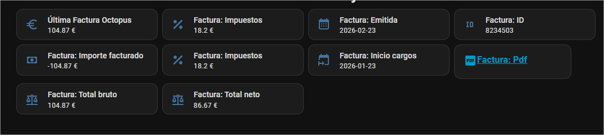

Fork de (https://github.com/MiguelAngelLV/ha-octopus-spain)
# Componente Octopus Spain para Home Assistant


## ¿Qué es Octopus Energy?

[Octopus Energy](https://octopusenergy.es/) es una comercializadora eléctrica española.

Entre otras ventajas, dispone de la **Solar Wallet**, un servicio que permite acumular crédito obtenido
por los excedentes solares para reducir a 0€ la factura así como acumular para posteriores facturas.


## ¿Qué hace el componente Octopus Spain?

Este componente conecta con tu cuenta de _Octopus Energy_ para obtener el estado actual de tu **Solar Wallet** 
así como los datos básicos de última factura.

Este componente ha sido revisado por los ingenerios de _Octopus Energy_ y ha recibido su visto bueno.

## Instalación

Puedes instalar el componente usando HACS:

### Directa usando _My Home Assistant_
[](https://my.home-assistant.io/redirect/hacs_repository/?owner=mandinger&repository=fork-ha-octopus-spain&category=integration)


### Manual
```
HACS -> Integraciones -> Tres puntitos -> Repositorios Personalizados
```
Copias la URL del repositorio ( https://github.com/mandinger/fork-ha-octopus-spain ), como categoría seleccionas _Integración_ y pulsas en _Añadir_.


## Configuración

Una vez instalado, ve a _Dispositivos y Servicios -> Añadir Integración_ y busca _Octopus_.

Durante la configuración podrás elegir el tipo de autenticación:
- Credenciales (email y contraseña)
- API Key

La opción recomendada es usar **API Key**:
- Si ya tienes una API key, introdúcela y no se requiere email/contraseña.
- Si no tienes API key, puedes usar email/contraseña y activar la opción **"Usar mis credenciales para obtener una API key"** durante la configuración.
- Importante: Octopus Energy España no ofrece directamente una forma para que el usuario genere o gestione sus API keys; la integración puede generarla por ti.
- Al generar una nueva API key, se invalidarán las API keys anteriores de ese usuario.
- La API key generada solo se muestra una vez para que puedas copiarla.

Podrás cambiar el método más tarde desde las Opciones de la integración. Para más información sobre tu cuenta, consulta [Octopus Energy](https://octopusenergy.es/).


## Entidades
Una vez configurado el componente, tendrás un conjunto de entidades por cada cuenta que tengas asociada a tu email (normalmente una). La referencia completa de entidades, atributos y servicios está en [docs/FEATURES.md](docs/FEATURES.md); el backlog de mejoras en [docs/IMPROVEMENTS.md](docs/IMPROVEMENTS.md).

### Solar Wallet
La entidad Solar Wallet devuelve el valor actual de tu Solar Wallet. Este valor (en euros) estará actualizado al de tu última factura. Actualmente no se puede consultar en tiempo real.

## Octopus Credit
La entidad Octopus Credit devuelve el valor actual de tu crédito en Octopus obtenido por cuentas referedidas u otras posibles bonificaciones.

### Última Factura
Esta entidad devuelve el coste de tu última factura.

Adicionalmente, en los atributos, están disponibles las fechas de emisión de esa factura así el periodo (inicio y final) de la misma.

### Sensores de Factura (individuales)
Además del sensor agregado "Última Factura Octopus", el componente expone sensores individuales para cada campo de la última factura. Esto facilita su uso directo en tarjetas, automatizaciones y gráficos:

- sensor.factura_importe_facturado: Importe facturado (€)
- sensor.factura_total_bruto: Total bruto (€)
- sensor.factura_total_neto: Total neto (€)
- sensor.factura_impuestos: Impuestos (€)
- sensor.factura_emitida: Fecha de emisión (fecha)
- sensor.factura_inicio_cargos: Inicio de cargos (fecha)
- sensor.factura_pdf: Estado del PDF (atributos url remota y copia local)
- sensor.factura_id: Identificador de la factura

Nota: Si tienes varias cuentas en Octopus, los nombres visibles de las entidades incluirán el identificador de la cuenta entre paréntesis, p. ej. "Factura (mi_cuenta): Total neto".

Para ver una tarjeta de ejemplo con estos sensores, consulta el panel de muestra en [ha/dashboard.yml](ha/dashboard.yml).

### PDF de la factura (descarga local)
El enlace de PDF que devuelve Octopus es una URL firmada que **caduca a los pocos minutos**. Para que siempre tengas un enlace válido, la integración descarga automáticamente el PDF de la última factura y lo guarda en `config/www/octopus_spain_fork/`, sirviéndolo en una URL permanente `/local/octopus_spain_fork/<cuenta>/invoice_<id>.pdf` (atributos `PDF local` del sensor de factura y `local_url` del sensor PDF).

⚠️ **Privacidad**: Home Assistant sirve `config/www` sin autenticación a cualquier dispositivo que alcance tu instancia; ten en cuenta que las facturas contienen datos personales.

También existe el servicio `octopus_spain_fork.download_invoice` para forzar la descarga:

```yaml
service: octopus_spain_fork.download_invoice
data:
  account: "A-12345678"  # opcional
```

### Tarifa y contrato
Sensores con tu tarifa actual y sus precios: nombre de tarifa, precio de la energía (€/kWh), precio de la potencia, compensación de excedentes (si aplica), potencia contratada (kW) y CUPS (diagnóstico). Detalles en [docs/FEATURES.md](docs/FEATURES.md).

### Precio actual y precios por periodo (2.0TD)
- **Precio Actual**: precio vigente en €/kWh según el periodo 2.0TD en curso (punta/llano/valle, incluyendo fines de semana y festivos), recalculado cada hora mediante [tariff-td](https://pypi.org/project/tariff-td/). Atributos: `period` y precio sin impuestos.
- **Precio Punta / Llano / Valle**: sensores individuales con el precio de cada periodo (con impuestos; el precio sin impuestos va como atributo).

Estos sensores solo se crean si tu tarifa tiene precios de 3 periodos.

### Consumo del último día
Sensor "Consumo Último Día" con el total en kWh del último día con datos horarios disponibles (atributo `Fecha`).

### Próxima facturación y pago
Sensores con la fecha de la próxima facturación (con el periodo en curso como atributos) y el importe previsto del próximo pago.


## Consumo eléctrico (estadísticas)
El componente no ofrece consumo en tiempo real. En su lugar, importa de forma retroactiva los datos horarios de consumo facilitados por Octopus y los inserta en el sistema de estadísticas de Home Assistant.

- Fuente: datos horarios (hourly) de consumo por cuenta.
- Funcionamiento: en cada actualización se vuelve a consultar el mes natural en curso, usando la zona horaria de Home Assistant, y se reimportan las estadísticas horarias acumuladas en un único `statistic_id` externo estable. Esto permite corregir horas que Octopus publica con retraso o que aparecen días después.
- Si Octopus todavía no ha publicado datos horarios del mes, se crea una estadística base con el total acumulado anterior para que el Panel de Energía pueda reconocer la estadística.
- Backfill inicial: en instalaciones nuevas (sin estadísticas previas) se importan hasta 365 días de histórico horario en bloques de 30 días. Las series existentes no se modifican.
- Diagnóstico: la entidad incluye atributos como `current_month_imported_total_kwh`, `api_data_through`, `hours_not_yet_available`, `current_month_api_hourly_rows`, `current_month_hourly_rows` y `current_month_zero_filled_hours` para comprobar hasta qué hora ha devuelto datos la API.
- Tipo de dato: estadística externa con suma acumulada por hora.
- Unidad: kWh.
- Identificador de estadística (`statistic_id`): `octopus_spain_fork:energy_consumption_<cuenta_slug>`.
- Nombre mostrado en HA: "Consumo Electrico" o "Consumo Electrico (<cuenta>)" cuando hay varias cuentas.

### Excedente solar (estadísticas)
Si tu cuenta tiene Solar Wallet, el componente también importa la energía **exportada a la red** (generación) como estadística acumulada:

- Identificador: `octopus_spain_fork:energy_export_<cuenta_slug>` ("Excedente Solar").
- Puedes seleccionarla como **"Retorno a la red"** en el Panel de Energía.
- Las horas sin producción (noche) que la API omite se rellenan con 0 tras confirmarlas contra los totales diarios.

Uso en interfaz:
- Tarjeta "Gráfico de estadísticas": selecciona la estadística con el nombre anterior para visualizar la serie acumulada por horas.
- Panel de Energía: puedes seleccionar esta estadística como fuente de consumo (al ser kWh con suma acumulada y marcada como externa).
- Mas detalles pendientes de documentación.

## Uso

Podrás usar estas entidades para visualizar el estado así como crear automatizaciones para informate, por ejemplo, 
cuando se produzca un cambio en el atributo "Emitida" de última fáctura.


Ejemplo de panel (dashboard):

Puedes encontrar un panel de ejemplo listo para usar en [ha/dashboard.yml](ha/dashboard.yml). Copia su contenido en tu dashboard (modo YAML) o adáptalo a tus necesidades.



## Licencia

Este repositorio incluye una licencia MIT en [LICENSE.txt](LICENSE.txt), pero el proyecto está basado en código de
[MiguelAngelLV/ha-octopus-spain](https://github.com/MiguelAngelLV/ha-octopus-spain), que no incluía una licencia
explícita en el momento en que se creó este fork.

Por ese motivo, la licencia MIT de este repositorio se aplica únicamente a las contribuciones, cambios y código nuevo
añadidos en este fork por sus autores. No pretende relicenciar el código preexistente del proyecto original ni conceder
derechos sobre partes cuyo copyright pertenezca a terceros.

## 💜 Apoya el proyecto

Si te está gustando la integración y todavía no eres cliente de Octopus Energy, ¿por qué no usar mi enlace de referido al darte de alta?

👉 [https://share.octopusenergy.es/subtle-prize-761](https://share.octopusenergy.es/subtle-prize-761)

*If you are enjoying the integration, why not use my referral link if you're not already a part of Octopus Energy?*
